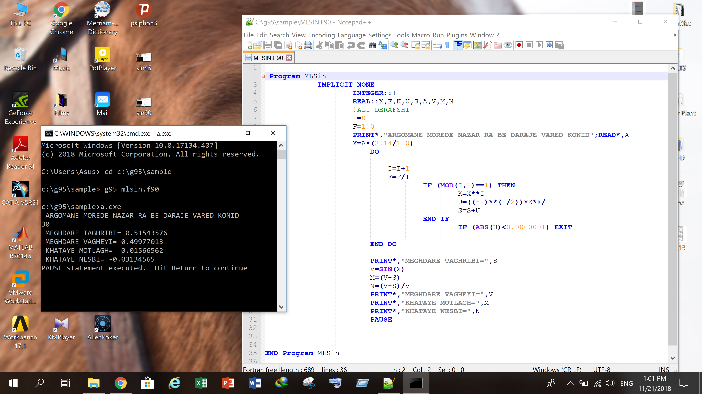
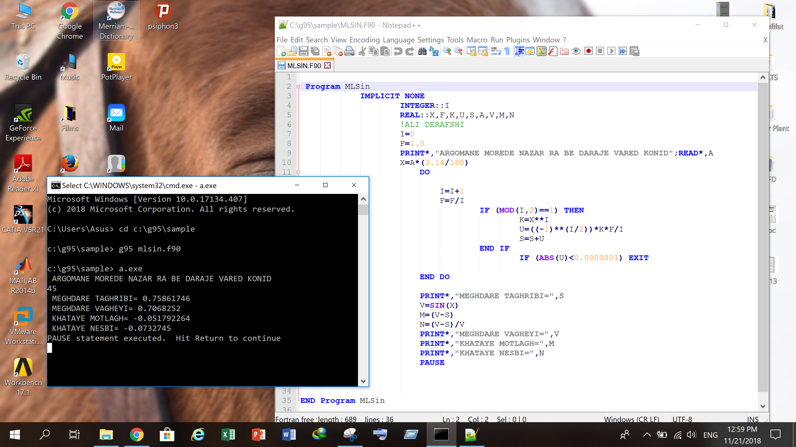
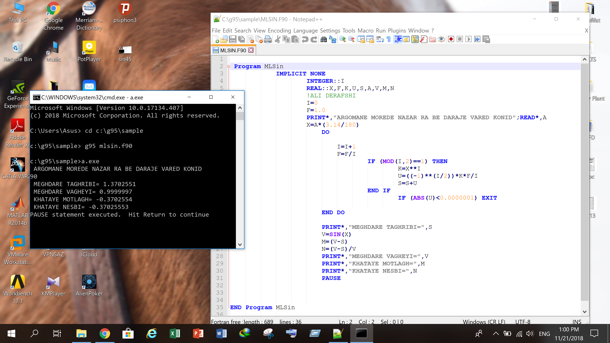

# Maclaurin Series Computation using Fortran

## Overview

This project implements the **Maclaurin series expansion** for trigonometric functions (sin, cos) using **Fortran**.  

The program computes function values up to a user-defined degree of approximation and demonstrates the convergence behavior of the series. Numerical results are captured for selected angles and compared with exact values.

Screenshots of outputs for **sin(30°), sin(45°), and sin(90°)** are included.

---

## Objectives

- Implement the Maclaurin series for sin(x) in Fortran
- Allow user-defined degree of approximation
- Compare numerical results with exact values
- Observe convergence and error behavior

---

## Software Used

- Fortran compiler (gfortran or g95)
- Notepad++ (code editing)
- Command Prompt / Terminal
- Screenshots captured for results

---

## Code

The main program is located in:

code/mlsin.f90


It calculates the Maclaurin series for sine function using iterative summation and prints:

- Approximate value
- Exact value
- Absolute error
- Relative error

---

## Output Screenshots

- **sin(30°)**



- **sin(45°)**



- **sin(90°)**



---

## Usage Instructions

1. Navigate to the `code/` folder.
2. Compile the Fortran code using:

```bash
g95 mlsin.f90 -o mlsin.exe
